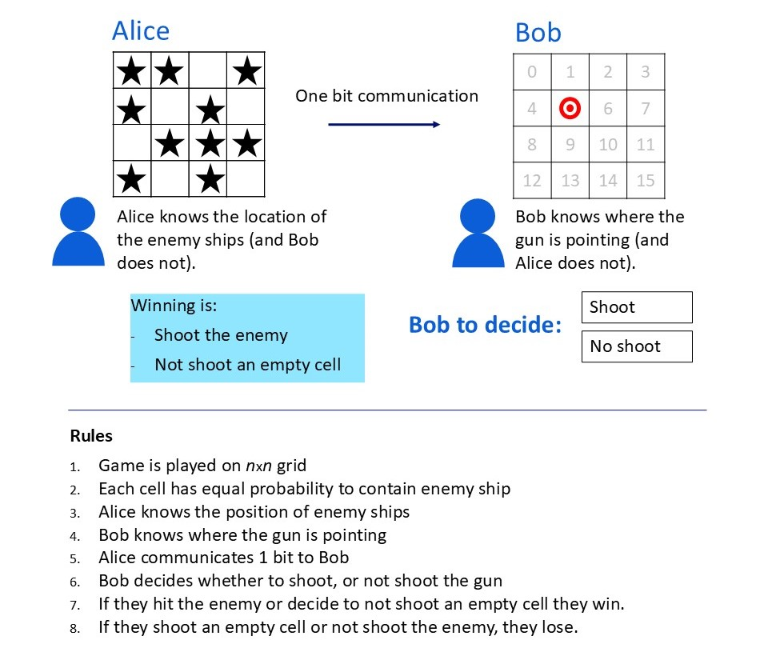
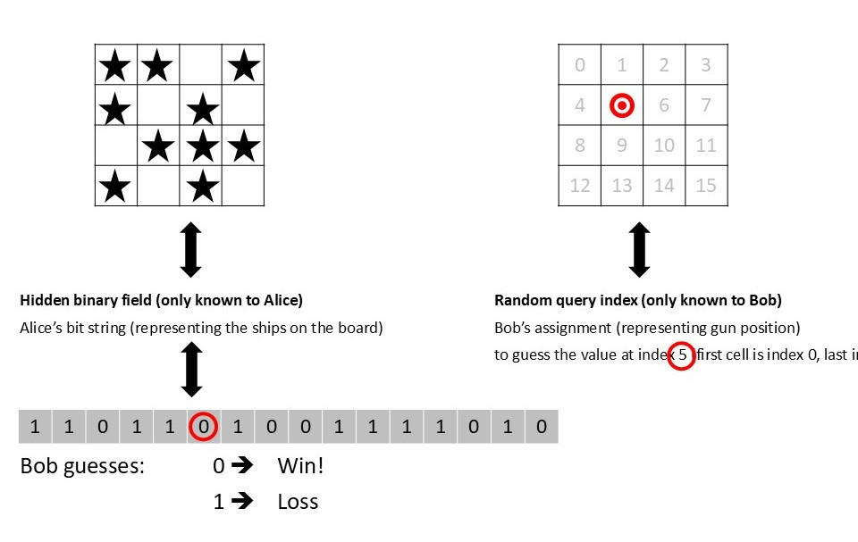

# The Best Bit Alice Can Send

*Why the most informative message isn’t the winning one.*

*Alice and Bob play a collaborative game of SeaBattle. They both have a part of the information needed to win, and Alice can send Bob just one bit. Shannon’s information theory tells us how much information is carried by that signal, but (as it turns out) this is not the parameter to optimize for a winning strategy.*

Alice and Bob have to work together to beat an enemy fleet. Alice can see the whole field — a grid, each cell either holding an enemy ship or empty water. Bob operates the gun. He can see to which cell it points but cannot control it. Bob must decide — shoot, or hold fire. Alice can help him, yet her signal line carries exactly one bit: a single 'yes' or 'no', sent before she knows where the gun will point, received by a Bob who cannot see the ships.

What is their best strategy? And, since a clever enemy will study how they play, what strategy cannot be exploited, even by an adversary who knows it in full?

> **Figure 1:** *The game: Alice sees the whole battlefield, Bob operates the gun, and neither controls where it points. One bit connects them. Image by author.*

In this post, we will discuss this game and follow it all the way to its provably best strategy. Stripped of the ships, it is known as a 'random access code' [1]: Bob has to guess the value at one index of a string that only Alice knows. Alice may encode her string into a single bit, but she does not know which index Bob will be asked to guess. It is tempting to think Alice should use her bit to convey as much information as possible.

But, as we will see, the optimal strategy sends *less* information than it could.

> **Figure 2:** *Stripped of the ships: a board read in a fixed order is a bitstring — ship is 1, sea is 0. The gun's cell is Bob's index. Image by author.*

### Gaming the Game Master

Let us first make the threat precise. Playing against the worst case means imagining a 'game master': an adversary who knows their strategy in full. Against any *deterministic* strategy, this game master does not just win often; he wins always. If Alice's encoding and Bob's response are fixed rules, the game master can anticipate every step: he picks a board and gun index precisely such that the rule fails.

So Alice and Bob need to be unpredictable, and they can arrange this before the battle: they agree on a shared source of randomness that the game master cannot control (cosmic background radiation would do) and use it to scramble the game. Alice flips her board cell-by-cell according to the shared random pattern before encoding; Bob applies the same pattern to undo the flips.

Whatever board and whatever cell the game master picks, by the time it reaches their strategy it looks like a uniformly random one; the game master cannot steer towards the worst possible setup for their strategy.

By scrambling, Alice and Bob have turned every input into a random input — so the worst the game master can do to them leads to their *average* performance over random boards. Worst case and average case have become the same number (this equivalence is known as Yao's principle, and it is how the authors of [1] attack the problem).

So the question "what is the best strategy against an all-knowing adversary?" has become: "what is the best strategy on average?" — and averages over random boards can simply be counted.

### The Majority Wins

With the game master out of the way, let us evaluate what Alice and Bob can do. The scrambling has made the game fully symmetric: every board is equally likely, and every cell looks like every other cell. So it makes no sense for Bob to follow a different strategy per index. The best he can do is always follow Alice's bit — she says 'shoot', he shoots — and leave the encoding to Alice. For Bob, this approach is called the identity strategy.

From the same perspective, Alice's move follows. Her bit will be applied unchanged to whichever cell the gun lands on, so she should send the value that gives Bob the highest chance: the bit value that occurs most on her board, the majority. Ambainis, Leung, Mancinska and Ozols proved this optimal in 2009 [1]. For an even number of cells, there are also boards where the count ties — as many cells with a ship as with sea. For these, Alice can flip a coin to generate her communication.

We will see that these tied boards prove to be crucial. The picture below lays out the full partition of the sixteen boards for a grid of 4 cells, including the six tied boards.

> **Figure 3:** *Alice's encoding for $n=4$: all sixteen boards arranged by number of ships (1, 4, 6, 4, 1). The bottom rows say 'hold', the top rows say 'shoot' — and the six tied boards in the middle belong to neither until a tie-break agreement assigns them. Image by author.*

How well does it do? For 4 cells, there are sixteen boards, each equally likely. For the boards with either zero or four ships, Bob will always guess right if he follows Alice's signal. With one or three ships (8 boards out of 16), they win in 3 out of 4 games. On the six tied boards, the win rate is 50%. Adding everything up the success rate is $1/16 \cdot 1 + 4/16 \cdot 3/4 + 6/16 \cdot 1/2 + 4/16 \cdot 3/4 + 1/16 \cdot 1 = 11/16$ — modestly, but strictly, better than the $1/2$ of pure guessing.

### What Do We Expect to Find?

Before we derive the win rate for boards with any (even) number of cells, let us write down what intuition predicts:

1. We expect that in an optimal strategy Alice should split the possible $2^n$ boards into two halves, so that her single bit carries the maximum possible information according to Shannon;
2. We expect that there are ‘good’ and ‘bad’ ways to handle ties, with several agreements available (flip a coin, always say 'shoot', copy some fixed cell); some must surely be better than others;
3. We expect that an encoding that gives Bob more information about Alice’s board (i.e., the position of the ships) should win more often.

As we will see, all three intuitions will turn out to be wrong.

### The Tied Boards

For boards with a clear majority, the strategy is settled — but can Alice and Bob still optimize the tied cases? They have several agreements available, and from an information perspective these are far from equal.

In a tie situation, Alice could copy the content of a fixed cell. On tied boards this splits evenly, so overall she sends a 'shoot' for exactly as many boards as a 'hold'. This equal split gives Bob the most information on Alice's board overall. As an alternative strategy, she could always say 'shoot' when tied. Now every board still maps to a definite message, but more boards get a 'shoot' than a 'hold', and an unbalanced message carries less information.

Or, as a third option, she can flip a coin: the tied boards then get a 'shoot' or 'hold' stochastically — and this reduces the information Bob receives about Alice's board even further.

So the three agreements form a clean ladder, from maximally informative down to deliberately noisy. The information measure we use is Shannon's, and it can simply be computed — for a board of 4 cells:

> **Figure 4:** *Three tie-break agreements for 4 cells. Every information measure falls down the ladder; the win rate does not move. Image by author.*

The win-rate is clearly decoupled from the amount of information Bob has about Alice’s board — the `copy a fixed cell` agreement even tells Bob 50% more about Alice's board than the coin flip — and the win rate does not move. The intuitions we wrote down above fall through: knowledge about Alice's board is not the same as optimally guessing the value at a specific index. Therefore, the equal split is not required, the tie-break does not matter, and more information buys not a single extra win.

The reason a tie-break cannot matter is that whatever Alice sends matches exactly half the cells. But that only deepens the question: if information does not govern the win rate, what does?

### Only the Ties Matter

The answer is first derived by Ambainis, Leung, Mancinska and Ozols [1] (although in a slightly different representation).

$$P_{\text{maj}} = \frac12 + \frac12\,P_{\text{tie}},$$

where $P_{\text{tie}}$ is the probability of drawing a tied board. The entire advantage over blind guessing is half the tie probability. Nothing else survives.

To see why, put yourself at Bob's cell and suppose it holds a ship. Bob wins if Alice says 'shoot', and whether she does depends mostly on the other $n-1$ cells. With $n$ even, there is an odd number of other cells, so it cannot balance: the excess is $+1,+3,\dots$ or $-1,-3,\dots$. By symmetry, each positive value is exactly as likely as its negative twin. Every positive excess is a win — Bob's ship rides a majority that was already there. Every negative excess is a loss, except $-1$.

At $-1$, the other cells are one ship short, and Bob's own ship pulls the whole board up to a tie: Alice flips her coin, and half the time, by accident, he still gets the right instruction. (A board whose other cells sit at $-1$ plus his ship is precisely a tied board — that is where $P_{\text{tie}}$ enters the formula.)

If Bob's cell holds sea instead, the same story runs with the signs reversed. So wins and losses cancel exactly, pair by pair, and the only thing left standing above one half is the softened loss at $+1$: the ties.

The picture that makes this transparent is a single row of Pascal's triangle (Figure 5). With Bob's cell fixed, the distribution of the other $n-1$ cells is row $n-1$: for $n=8$, the familiar $1, 7, 21, 35, 35, 21, 7, 1$.

Colour it by what Alice sends — she sends a '1' where the board is mostly ones (blue, a win for Bob's ship) and a '0' where it is mostly zeros (red, a loss) — and the cancellation is visible: the row is a palindrome of even length, mirror pairs annihilate win against loss all the way in, and one cell just right of the central axis refuses to be a plain loss. That cell is the tie, and it is the entire prize: for $n=8$ it has weight $35$ out of $128$, so $P_{\text{tie}} = 35/128$ and the win rate is $\frac12 + \frac12 \cdot \frac{35}{128} \approx 0.637$.

(For the smaller $n=4$ board, the same count gives $P_{\text{tie}} = \frac{3}{8}$ and the $11/16$ we saw above.)

![Eight vertical bars arranged as a symmetric histogram, heights 1, 7, 21, 35, 35, 21, 7, 1, labelled by the number of ones from '8x 1' on the left to '1x 1' on the right. The four left bars (mostly-ones boards) are blue; the three right bars (mostly-zeros boards) are red; the fifth bar, the exact tie at '4x 1', is split with a blue top and a red bottom. A legend reads "Right answer = 1, Alice sends a 1: Win" in blue and "Right answer = 1, Alice sends a 0: Loss" in red. An outlined arrow points to the split bar with the note "Tied strings: Alice sends a random '0' or '1'." Below the bars: Win rate P = 1/2 + 1/2 · P_tie.](Figure_5-1.JPG)

> **Figure 5:** *The cancellation, drawn for a board of 8 cells. The 128 boards that Bob's cell could complete, grouped by how many ones they hold and coloured by what Alice's majority bit does: blue where she sends '1' and Bob's ship correctly gets a 'shoot', red where she sends '0' and misses. Each blue bar has an equal red mirror, so wins and losses cancel — all except the split tie bar just right of centre, where Alice sends a random bit and wins half the time. The blue area over the whole is the win rate: $\frac12$ from the balance, plus $\frac12 \cdot P_{\text{tie}}$ from that surviving half-bar (here $P_{\text{tie}} = 35/128 \approx 0.27$, so the win rate is about $0.64$). Image by author.*

There is an irony here. In [1], the tied strings are introduced as the 'bad' ones — the boards on which majority does no better than guessing. Yet in the final formula they are the only thing standing between the optimal strategy and a coin flip. Only for tied boards did the cell that Bob is interested in flip the balance for Alice; for any other board the communication from Alice is dominated by the $n-1$ other cells.

### The Advantage Vanishes

![A tall, narrow bell-shaped histogram of 64 vertical bars, with a dashed bell curve overlaid that traces the bar tops. Bars left of centre (mostly-ships boards, from '64x 1' down to '33x 1') are blue; bars right of centre (mostly-empty boards, '31x 1' down to '1x 1') are red; the single central bar at '32x 1' — the exact tie — is split blue over red and is only a thin sliver compared with the n = 8 case. Brackets label the blue side "String has mostly 1's — Alice sends a '1'" and the red side "String has mostly 0's — Alice sends a '0'". Annotations note that the number of tied strings scales as √n, the tied probability as 1/√n, and that the win rate P = ½ + ½·P_tie approaches ½ at rate 1/√n.](Figure_6-1.JPG)

> **Figure 6:** *The same picture as Figure 5 for a board of 64 cells. The histogram is now tall and narrow — a bell curve — and the tie bar in the middle has shrunk to a sliver. The number of tied boards grows only as $\sqrt{n}$ while the total grows as $n$, so the tied fraction falls as $1/\sqrt{n}$. This is what drives the win rate down: $P = \frac12 + \frac12 \cdot P_{\text{tie}}$, and as $n$ grows, $P_{\text{tie}} \to 0$, so the win rate approaches $\frac12$. Image by author.*

How fast does the win rate decline if $n$ grows? The Pascal picture already tells us. As $n$ grows, the row's silhouette settles into a bell curve. The total mass of the row is fixed, but the bell's width grows like $\sqrt{n}$: the same mass spreads over ever more columns, so the columns near the centre must shrink like $1/\sqrt{n}$.

On a full 8×8 battlefield of sixty-four cells, the edge over blind guessing is down to about five percentage points, and it keeps thinning as the board grows. So the optimal strategy — provably unbeatable — converges to a coin flip.

### Knowing Less, Winning the Same

So what is Shannon's information doing, if not predicting wins? It is measuring the right thing for a different game. Information theory counts how much Alice's message says about the board overall; it is indifferent to whether it says it about the cell that will matter — and in this game, which cell matters is decided after Alice has made her decision. Her most informative bit is a parcel, perfectly packed, addressed to a question that is not asked.

There is in fact a precise way to say when Alice's bit speaks about Bob's cell at all. Condition on the other $n-1$ cells: whenever their majority is already settled by two or more, her message is fixed regardless of Bob's cell — it carries strictly zero information about it, and Bob wins exactly half the time. Only when the others hang at one ship from balance is his cell *pivotal*: it either seals the majority or creates the tie.

The entire advantage hangs on these pivotal boards — the arithmetic closes exactly, since the pivotal boards occur with probability $2P_{\text{tie}}$ and pay $3/4$ where the rest pay $1/2$.

### The Recipe

So, the full recipe for Alice fits on three lines:

1. scramble — use shared randomness to flip the board, so the game master cannot derail your deterministic strategy;
2. Alice reports the majority of the scrambled board;
3. on ties, Alice flips a coin;

Bob then uses Alice’s bit as his guess for his decision to shoot or hold.

Note how strange the third line is for a provably optimal recipe: an instruction left genuinely blank, because every way of filling it wins the same. And note the two ingredients of different character — a shared *resource* (the randomness) and a *rule* (the majority strategy). The shared resource is doing the heavy lifting against the game master; the majority strategy generates the proven optimal win rate against uniform inputs.

### Conclusion

The best bit Alice can send is not the one that carries the most information in general; it is the one that survives a question that has not yet been asked. Concretely: Alice should send the majority of a scrambled board, leading to a win rate exactly half the chance of a tie, fading like $1/\sqrt{n}$ as the battlefield grows.

Along the way we lost three reasonable intuitions, and the deepest loss is the first: making her bit as informative as possible is simply not what the game rewards, because Alice must commit to what her bit *means* before Bob's question exists.

The shared randomness bought Alice and Bob their advantage against the game master — could a stronger shared resource buy more? Quantum mechanics turns out to provide exactly such a resource. That, however, is a story for the next post.

The simulations and source code are available on [the QSeaBattle GitHub repo](https://github.com/robhendrik/QSeaBattle).

### References

[1] A. Ambainis, D. Leung, L. Mancinska, M. Ozols, *Quantum Random Access Codes with Shared Randomness*, arXiv:0810.2937 (2009).
